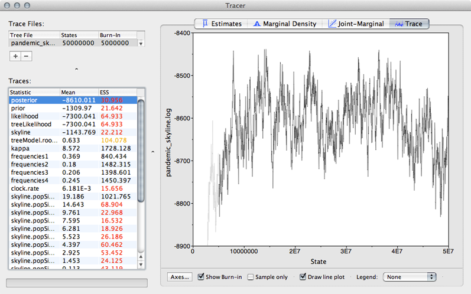

## Examine the skyline output

Here, we begin by looking at estimated parameter values from the skyline analysis.

**Open Tracer.**

Tracer is designed to take a tab-delimited file in which each line represents a separate MCMC sample.

**Click '+' and select 'pandemic_skyline.log' from the resulting dialog.**

This displays each parameter as a separate element in the 'Traces' list.
First off, we need to assess whether the MCMC has converged to its stationary distribution.
The simplest way to do this is to look at MCMC state through time.

**Select 'posterior' from the list of 'Traces' and select the 'Trace' panel on the right.**

This shows the posterior log probability of the model given the data for each step in the MCMC chain.

The MCMC chain starts out in a poor configuration, but eventually converges on the correct stationary distribution.
Because of this, the initial steps in the MCMC need to be discarded as burn-in.
Here, it looks like the default 10% or 5 million steps may not have been enough.

**Enter `10000000` (10 million) into the field for 'Burn-in'.**

It's good to check other parameters to confirm that their values appear to have burnt-in as well.
There are more rigorous ways to assess burn-in, but we will stick with this simple eye-ball-the-trace method for the practical.

After burn-in each sample from the MCMC represents a sample from the posterior distribution of model parameters given the data.
For instance, we can look at estimates of TMRCA across the MCMC

**Select 'treeModel.rootHeight' from the list of 'Traces' and select the 'Estimates' panel on the right.**

This shows the distribution of posterior values of TMRCA.
The mean estimate is 0.63 years back from 2009.75, so 2009.12.
However, other estimates are also consistent with the data.
The 95% credible interval lies between 0.53 and 0.77 years, so between 2008.98 and 2009.22.
These estimates correspond to the following calendar dates:

      | Lower       | Mean        | Upper
---   | ---         | ---         | ----
TMRCA | 24 Dec 2008 | 14 Feb 2009 | 22 March 2009

Because [autocorrelation](http://en.wikipedia.org/wiki/Autocorrelation) exists between samples in the MCMC chain, our estimates of means and credible intervals have more variance than would be expected from the 1600 independent samples.
This inflation of variance can be estimated based on the effective sample size (ESS), which gives the number of independent samples that would give the same variance as the observed autocorrelated samples.

In this case, we can see that some parameters have very little autocorrelation, for instance, kappa with an ESS of 1489.
However, TMRCA has substantial autocorrelation (it's difficult to adjust TMRCA without adjusting parameters in the MCMC), giving it an ESS of 87.

The error in the estimate of a mean is equal to the sample standard deviation divided by the square root of the sample size.
In this case, Tracer gives the standard error of the mean estimate of TMRCA as 0.008, which is equal to 2.9 days.
Thus, the true mean has a 95% chance of lying between 9 Feb and 19 Feb.

**Select all 10 of the 'skyline.popSize' elements from the list of 'Traces'.**

This shows the estimated effective population size for each of the 10 windows in the skyline demographic model.
The first window is closest to the present and the last window is furthest in the past.
We can see that population size appears to increase from the emergence the virus in the human population through the course of 2009.

We can also have Tracer give a more detailed reconstruction of population history.

**Select 'Bayesian Skyline Reconstruction...' from the 'Analysis' menu.**

**Input `pandemic_skyline.trees` in the 'Trees Log File' dialog.**

By default this will give population size going backwards from the present.
We scale time more appropriately by setting the time of the most tip.

**Input `2009.75` as 'Age of youngest tip'.**

**Click on 'OK' to run the analysis.**

This will open a window with the following result:

This shows population size through time as inferred by the skyline demographic model.
It appears that population size initially grew rapidly, but slowed as the year progressed.
