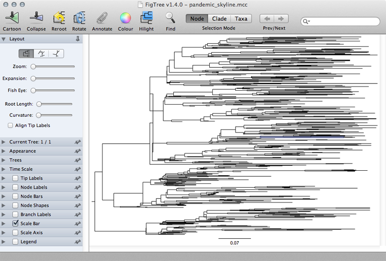

## Examine the skyline tree

Here, we will use FigTree to display the phylogeny from the skyline analysis.
However, first we want to condense the posterior sample of 1600 trees to something more manageable.
For this, we will use the helper program TreeAnnotator that is distributed alongside BEAST.

**Open TreeAnnotator.**

Rather frustratingly, some BEAST programs use the minimum state number as burn-in (here 10 million), while others take a count of states to throw away (here 400).
TreeAnnotator takes the latter.

**To burn-in the first 10 million states, enter `400` for 'Burnin'.**

**Enter `pandemic_skyline.trees` as 'Input Tree File' and enter `pandemic_skyline.mcc` as 'Output file'.**

This will print out a single maximum clade credibility (MCC) tree to the file `pandemic_skyline.mcc`.
For convenience, I've included this file as `output/pandemic_skyline.mcc`.

We can now open this MCC tree in FigTree.

**Open FigTree, select 'Open...' from the 'File' menu and choose the file `pandemic_skyline.mcc`.**

This displays the tree with each taxon labeled.
We can get a better idea of the structure of the phylogeny with a bit of tree manipulation.

**Turn off 'Tip Labels' in the left-hand list.**

**Under 'Trees', turn on 'Order nodes' and choose 'decreasing'.**

A pattern of population expansion is visible in the phylogeny as rapid coalescence in early 2009 and slower coalescence later in 2009.
Standing genetic diversity increases through time.
