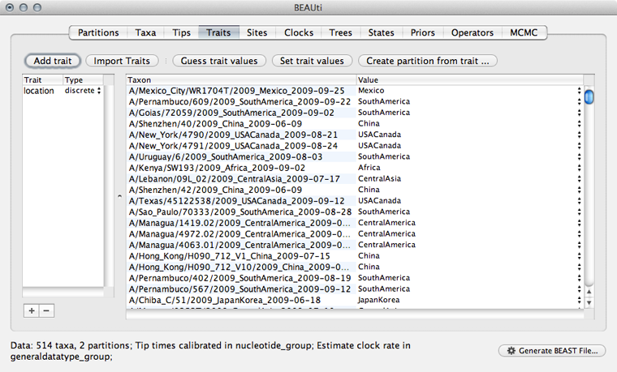
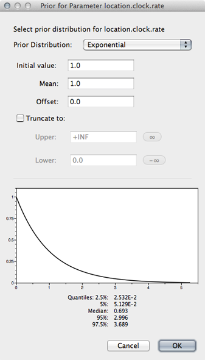

## Prepare a phylogeographic analysis

Here, let's keep the same model of logistic growth as before.

**Open BEAUti and rebuild the logistic growth analysis.**

We next need to load the geographic metadata into BEAUti.

**Select the 'Traits' panel and click on the 'Add trait' button.**

**In the resulting dialog 'Create a new trait' named location.**


Similar to tip dates, we will import trait values from taxon names.

**Click on 'Guess trait values' and choose 'second from last' in the 'Defined by its order' dropdown.**

**Enter `_` as the delimiter.**


Doing so results in a discrete trait being associated with each taxon.



We next need to give a model for how each location character state transitions to other location characeter states.

**Select the 'Sites' panel and click on 'location' in the left-hand list of data partitions.**

We will use a 'Symmetric substitution model' where the rate that A goes to B equals the rate that B goes to A.
Although the asymmetric model seems like it should better match reality, using it adds significant parameter complexity and additionally sacrifices a fair degree of robustness to sampling particulars.

**Select 'Infer social network with BSSVS'.**

I have no idea why this is called "infer social network".
BSSVS stands for Bayesian Stochastic Search Variable Selection.
It adds an indicator variable for each pairwise transition rate that specifies whether the rate is on or off, i.e. at its estimated value or at 0.
These indicators serve to decrease the effective number of rate parameters that need to be estimated and are helpful to include when trying to infer a sparse transition matrix.


As with the sequence partition, we also need to include a model of how geographic transition rate relates to time.

**Select the 'Clocks' panel.**

We will stick with the default 'Strict clock' for transitions among geographic locations.

**Select the 'Trees' panel.**

We don't need to do anything here, because the sequences and the geographic locations are based on the same underlying evolutionary tree.

**Select the 'States' panel and click on 'location' in the left-hand list of data partitions.**

In addition to reconstructing states at all ancestors, we are particularly interested in where in the world the pandemic emerged.

**Select 'Reconstruct states' at 'Tree Root'.**


We need to include priors on parameters associated with the phylogeographic model.

**Select the 'Priors' panel.**

We need to give a prior to the overall geographic transition rate.

**Select the 'location.clock.rate' prior and choose 'Exponential' from the dropdown.**

We will leave mean and initial value set to 1.0.



We will leave the proposals at their defaults.

**Select the 'MCMC' panel, set the length of the chain to `50000000`, set logging of parameters every `25000` steps and set the file name stem to `pandemic_geo`.**

**Save the analysis as `pandemic_geo.xml`.**

It will be helpful to edit the XML to give more interpretable logging.

**Open `pandemic_geo.xml` in a text editor and delete the strictClockBranchRates traits blocks from the the 'logTree' block as before.**

**Replace the gammaPrior with a uniform prior for 'logistic.t50' as before.**

```xml
<uniformPrior lower="0.0" upper="1.0">
	<parameter idref="logistic.t50"/>
</uniformPrior>	
```

Replace the file name `pandemic_geo.location.rates.log` with `pandemic_geo.rates`.
Replace the output in 'pandemic_geo.locationrateMatrixLog' with more interpretable estimates of indicators multiplied by rate values.
These are stored in 'location.actualRates'.

```xml
<log id="pandemic_geo.locationrateMatrixLog" logEvery="25000" fileName="pandemic_geo.rates">
	<statistic idref="location.actualRates"/>
</log>
```

Also, replace the file name `location.states.log` with `pandemic_geo.root`.

I've included this file with the practical as `pandemic_geo.xml`

### Next section

* [Run the phylogeographic analysis](10-run-the-phylogeographic-analysis.md)
