## Introduction

In 2009, a [variant of influenza H1N1](http://en.wikipedia.org/wiki/Pandemic_H1N1/09_virus) emerged through reassortment of bird, swine and human flu viruses, with surface proteins HA and NA of swine origin.
Owing to a lack of previous immunity to these proteins, this virus spread rapidly through the human population, causing a worldwide [pandemic](http://en.wikipedia.org/wiki/2009_flu_pandemic).
Here, we will investigate the growth of the virus population and its global spread using publicly available sequence data.
This tutorial walks through how to use [BEAST](http://beast.bio.ed.ac.uk/) and associated software to infer spatiotemporal dynamics from viral sequence data.
Accompanying slides on the theory behind this analysis are available in [theory/slides.pdf](theory/slides.pdf).

## Required software

* [BEAST](http://beast.bio.ed.ac.uk/) is used to infer evolutionary dynamics from sequence data.
* [BEAGLE](http://beast.bio.ed.ac.uk/BEAGLE) is a helper library that allows faster and more advanced functions to be run in BEAST. For this practical, it is not necessary to install CUDA drivers (step 2 in the BEAGLE installation).
* [Tracer](http://tree.bio.ed.ac.uk/software/tracer/) is used to analyze parameter estimates from BEAST.
* [FigTree](http://tree.bio.ed.ac.uk/software/figtree/) is used to analyze phylogeny estimates from BEAST.
* [Google Earth](http://www.google.com/earth/) is used to display phylogeographic reconstructions.

## Sections

1. [Compile sequence data](01-compile-sequence-data.md)
2. [Prepare a skyline analysis](#prepare-a-skyline-analysis)
3. [Run the skyline analysis](#run-the-skyline-analysis)
4. [Examine the skyline output](#examine-the-skyline-output)
5. [Examine the skyline tree](#examine-the-skyline-tree)
6. [Prepare a logistic growth analysis](#prepare-a-logistic-growth-analysis)
7. [Run the logistic growth analysis](#run-the-logistic-growth-analysis)
8. [Examine the logistic growth output](#examine-the-logistic-growth-output)
9. [Prepare a phylogeographic analysis](#prepare-a-phylogeographic-analysis)
10. [Run the phylogeographic analysis](#run-the-phylogeographic-analysis)
11. [Examine the phylogeographic output](#examine-the-phylogeographic-output)

## Prepare a skyline analysis

The program BEAST takes an XML control file that specifies sequence data, metadata and also details the analysis to be run.
All program parameters lie in this control file.
However, to make things easier, BEAST is distributed with the companion program BEAUti that assists in generating the XML.
Here, we will produce an XML that specifies a "skyline" analysis, in which we estimate changes virus population size through time.

**Open BEAUti.**

This will show a window with the 'Partitions' panel open.
We first need to load the sequence data.

**Click on the '+' or choose 'Import Data...' from the File menu and select `pandemic.fasta`.**

This will load a data partition of 514 taxa and 1664 nucleotide sites.

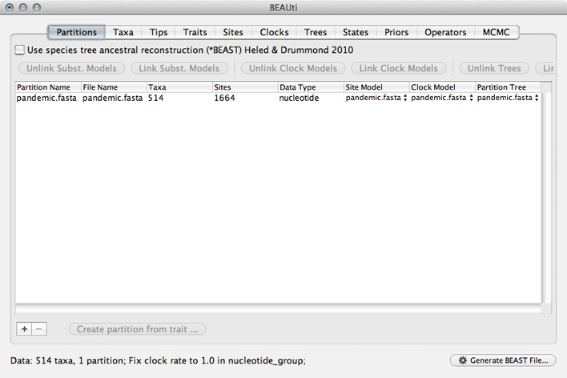

Double-clicking the partition will open a window showing the sequence alignment.
It's good to check to make sure the alignment is in order.

We next label each taxon with its sampling date.

**Select the 'Tips' panel, select 'Use tip dates' and click on 'Guess Dates'.**

We need to tell BEAUti where to find the tip dates in the taxon names.
Here, each taxon name ends with its date of sampling separated by an underscore.

**Select 'Defined by a prefix and its order'.**

**Select 'Order' equals 'last' and input `_` for 'Prefix'.**

**Select 'Parse as calendar date'.**

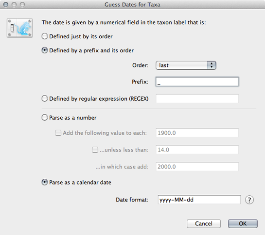

This will result in the 'Date' and 'Height' columns filing the the date forward from the past and the height of each taxon relative to the most recent taxon.


**Click on 'Date' to sort rows.**

It will be helpful for later to record that the most recent tip has a date of `2009.75`.

Next, we need to specify a model of the process by which nucleotide sites evolve.

**Select the 'Sites' panel.**

We default to a very simple model of evolution.
This shows that we are using an 'HKY' model to parameterize evolution between nucleotides.
This model includes a single 'kappa' parameter that specifies the rate multiplier on transitions (e.g. 'A' to 'G') vs transversions (e.g. 'A' to 'T').
We are estimating base frequencies and specifying no heterogeneity across nucleotide sites in the alignment.
Generally speaking, if internal branches on the tree are long then a more complex evolutionary model will be needed to capture the real branch lengths, while if internal branches are short, then inferences will be fairly robust to model choice.

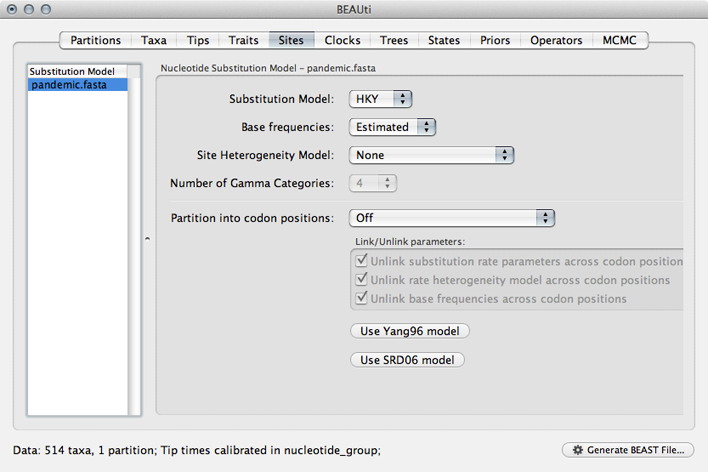

Next, we need to specify a molecular clock to convert between sequence substitutions and time.

**Select the 'Clocks' panel.**

We default to a strict molecular clock in which substitutions occur at the same rate across branches in the phylogeny.

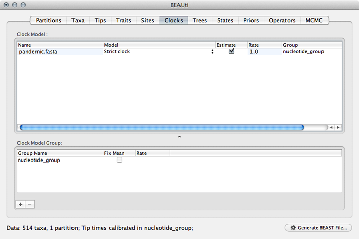

Next, we need to specify a model that describes phylogenetic structure based on some underlying demographic process.

**Select the 'Trees' panel.**

Here, we will choose a model that describes how the virus population size changes through time.
There are parametric models that assume some basic function (like exponential growth) and there are non-parametric models that don't make any strong assumptions about the pattern of change.
We begin by choosing a non-parametric model.

**Select 'Coalescent: Bayesian Skyline' from the 'Tree Prior' dropdown.**

This model assumes a fixed number of windows, where within each window effective population size is constant and there is some weak autocorrelation between windows to smooth the estimates.
We begin with the default 10 windows ('Number of groups'), and start with a random initial tree.


Generally, these non-parametric skyline (and skyride) models offer flexibility for the data to say what it wants to say.
However, these are relatively complex models and so suffer from the [bias-variance tradeoff](http://scott.fortmann-roe.com/docs/BiasVariance.html).
This often results in wide bounds of uncertainty to the resulting estimates.
We will return to this issue later on.

Next, we need to specify priors for each parameter in the model.

**Select the 'Priors' panel.**

For the most part, BEAST has very sensible default priors.
In this case, we can leave most of the priors at their default values.

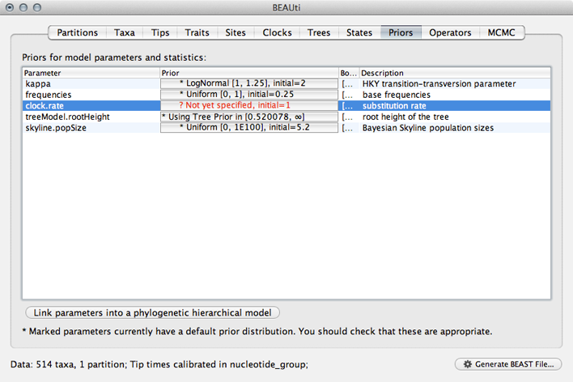

However, we are forced to choose a prior for evolutionary rate.

**Click on the prior for 'clock.rate' (currently highlighted in red).**

Although including improper priors will not harm parameter estimates, it will adversely impact the ability to do model comparison, and so it is not recommended.
Here, we still keep an uninformative prior on 'clock.rate', choosing uniform between 0 and 1.

**Select 'Uniform' from the 'Prior Distribution' dropdown.**

**Enter `0.0` as a lower-bound and `1.0` as an upper bound.**

We actually have a good expectation from knowledge of influenza mutation rates that 'clock.rate' should be near 0.005.
We include this as an initial value to aid convergence.

**Enter `0.005` as an 'Initial value'.**


After setting this, the 'clock.rate' prior no longer shows as red.

Next, we need to specify operators (or proposals) for the [MCMC](http://en.wikipedia.org/wiki/Markov_chain_Monte_Carlo) sampler.

**Select the 'Operators' panel.**

The exact choice of MCMC proposals will have no effect on eventual outcomes.
However, good proposals will make the MCMC more efficient and poor proposals will lead to MCMC inefficiency and longer run times.
In this case, we can stick with the default list of operators.

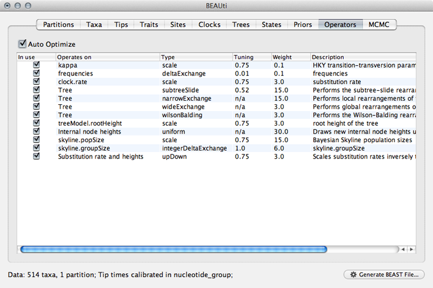

Next, we need to specify how often and where MCMC samples are logged to.

**Select the 'MCMC' panel.**

Generally, larger datasets will require longer chains and less frequent sampling.
I usually aim for 2000 samples, planning to throw out the first 500 or 1000 as [burn-in](http://en.wikipedia.org/wiki/Burn-in).

**Enter `50000000` (50 million) for 'Length of chain'.**

**Enter `25000` for 'Log parameters'.**

**Enter `pandemic_skyline` for 'File name stem'.**

This will result in 2000 samples logged to the files `pandemic_skyline.log` and `pandemic_skyline.trees`.

And that's it.  We just need to save the XML control file.

**Click on 'Generate BEAST File...'**

**Select Continue when shown the priors.**

**Save the XML as `pandemic_skyline.xml`.**

For the most part, BEAUti does a good job creating an XML optimized for the analysis at hand.
However, there are often small details that need to be cleaned up by hand.
In this case, BEAUti defaults to writing out evolutionary rates to every branch in the phylogeny.
However, with a strict clock model, every branch will have the same rate at a particular MCMC step and this rate will already by written to the log file.
Writing out these rates to the trees file will just result in an unnecessarily larger file.

**Open `pandemic_skyline.xml` in a text editor.**

XML is structured in a hierarchical fashion with logical blocks of markup surrounding by open (`<block>`) and close (`</block>`) tags.

**Find the XML block that specifies tree output called 'logTree'.**

```xml
<logTree id="treeFileLog" logEvery="25000" nexusFormat="true" fileName="pandemic_skyline.trees" sortTranslationTable="true">
	<treeModel idref="treeModel"/>
	<trait name="rate" tag="rate">
		<strictClockBranchRates idref="branchRates"/>
	</trait>
	<posterior idref="posterior"/>
</logTree>
```

**Delete the 'trait' block that contains 'strictClockBranchRates'.**

```xml
<logTree id="treeFileLog" logEvery="25000" nexusFormat="true" fileName="pandemic_skyline.trees" sortTranslationTable="true">
	<treeModel idref="treeModel"/>
	<posterior idref="posterior"/>
</logTree>
```

This fine-tuning of the XML can be quite helpful and there are quite a few more advanced analyses that require editing the XML rather than relying on BEAUti output.

I've included this XML with the practical as `xml/pandemic_skyline.xml`.

## Run the skyline analysis

This XML file contains all the information that BEAST requires.

**Open BEAST.**

**Click on 'Choose File...' and select `pandemic_skyline.xml`.**

By default, BEAST will have 'Allow overwriting of log files' turned off, so that you can't accidentally overwrite a previous run's output.
However, you'll often need to check this box when there are previous log files in the same directory that should be overwritten.

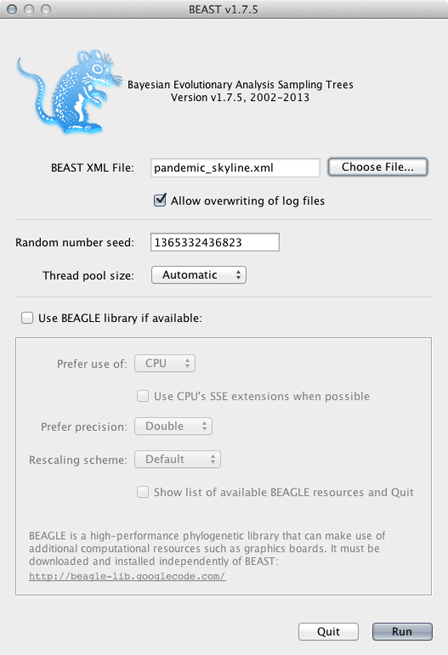

BEAGLE is turned off by default.
BEAGLE is an additional Java library that contains high-performance code to compute evolutionary likelihoods on phylogenetic trees.
Most of the BEAST analyses will work on the built-in BEAST engine.
However, some of the newer analyses will require BEAGLE.
In this case, we can leave it unchecked or checked as desired.

**Click on 'Run'.**

This will start the BEAST run and log MCMC setup and progress to a window.
The TMRCA ('rootHeight') and the per-year substitution rate ('clock.rate') will be logged to this window.
These two parameters often give a good idea of whether the MCMC appears to be behaving properly and help for monitoring convergence.
Additionally, the files `pandemic_skyline.log` and `pandemic_skyline.trees` will start to fill with MCMC samples.

Unfortunately, BEAST runs can take quite a long time, and it's not always clear how long they need to run.
Because of these time requirements, I almost never run BEAST analyses locally, preferring instead to get the XML up and running and tested locally and then running BEAST on a cluster node to perform the full analysis.
In this case, it took a single cluster node 16 hours to compute the 50 million MCMC steps, resulting in 2001 samples being logged and a 48 MB trees file.

I've included the resulting log file and tree file in the practical as `output/pandemic_skyline.log` and `output/pandemic_skyline.trees`.

## Examine the skyline output

Here, we begin by looking at estimated parameter values from the skyline analysis.

**Open Tracer.**

Tracer is designed to take a tab-delimited file in which each line represents a separate MCMC sample.

**Click '+' and select 'pandemic_skyline.log' from the resulting dialog.**

This displays each parameter as a separate element in the 'Traces' list.
First off, we need to assess whether the MCMC has converged to its stationary distribution.
The simplest way to do this is to look at MCMC state through time.

**Select 'posterior' from the list of 'Traces' and select the 'Trace' panel on the right.**

This shows the posterior log probability of the model given the data for each step in the MCMC chain.


The MCMC chain starts out in a poor configuration, but eventually converges on the correct stationary distribution.
Because of this, the initial steps in the MCMC need to be discarded as burn-in.
Here, it looks like the default 10% or 5 million steps may not have been enough.

**Enter `10000000` (10 million) into the field for 'Burn-in'.**

It's good to check other parameters to confirm that their values appear to have burnt-in as well.
There are more rigorous ways to assess burn-in, but we will stick with this simple eye-ball-the-trace method for the practical.

After burn-in each sample from the MCMC represents a sample from the posterior distribution of model parameters given the data.
For instance, we can look at estimates of TMRCA across the MCMC

**Select 'treeModel.rootHeight' from the list of 'Traces' and select the 'Estimates' panel on the right.**

This shows the distribution of posterior values of TMRCA.
The mean estimate is 0.63 years back from 2009.75, so 2009.12.
However, other estimates are also consistent with the data.
The 95% credible interval lies between 0.53 and 0.77 years, so between 2008.98 and 2009.22.
These estimates correspond to the following calendar dates:

      | Lower       | Mean        | Upper
---   | ---         | ---         | ----
TMRCA | 24 Dec 2008 | 14 Feb 2009 | 22 March 2009

Because [autocorrelation](http://en.wikipedia.org/wiki/Autocorrelation) exists between samples in the MCMC chain, our estimates of means and credible intervals have more variance than would be expected from the 1600 independent samples.
This inflation of variance can be estimated based on the effective sample size (ESS), which gives the number of independent samples that would give the same variance as the observed autocorrelated samples.

In this case, we can see that some parameters have very little autocorrelation, for instance, kappa with an ESS of 1489.
However, TMRCA has substantial autocorrelation (it's difficult to adjust TMRCA without adjusting parameters in the MCMC), giving it an ESS of 87.

The error in the estimate of a mean is equal to the sample standard deviation divided by the square root of the sample size.
In this case, Tracer gives the standard error of the mean estimate of TMRCA as 0.008, which is equal to 2.9 days.
Thus, the true mean has a 95% chance of lying between 9 Feb and 19 Feb.

**Select all 10 of the 'skyline.popSize' elements from the list of 'Traces'.**

This shows the estimated effective population size for each of the 10 windows in the skyline demographic model.
The first window is closest to the present and the last window is furthest in the past.
We can see that population size appears to increase from the emergence the virus in the human population through the course of 2009.

We can also have Tracer give a more detailed reconstruction of population history.

**Select 'Bayesian Skyline Reconstruction...' from the 'Analysis' menu.**

**Input `pandemic_skyline.trees` in the 'Trees Log File' dialog.**

By default this will give population size going backwards from the present.
We scale time more appropriately by setting the time of the most tip.

**Input `2009.75` as 'Age of youngest tip'.**

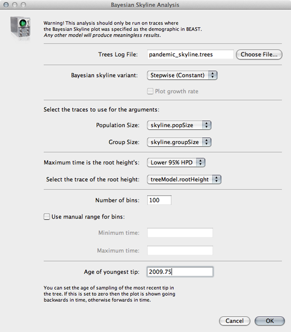

**Click on 'OK' to run the analysis.**

This will open a window with the following result:

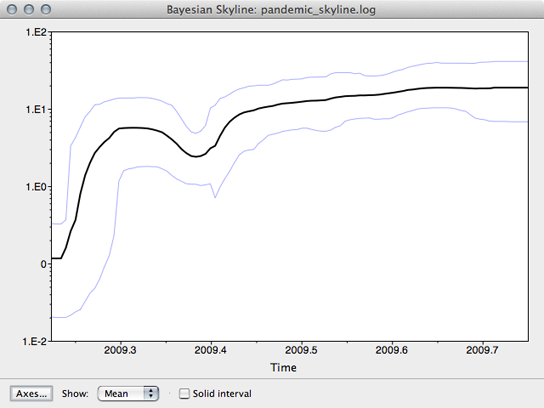

This shows population size through time as inferred by the skyline demographic model.
It appears that population size initially grew rapidly, but slowed as the year progressed.

## Examine the skyline tree

Here, we will use FigTree to display the phylogeny from the skyline analysis.
However, first we want to condense the posterior sample of 1600 trees to something more manageable.
For this, we will use the helper program TreeAnnotator that is distributed alongside BEAST.

**Open TreeAnnotator.**

Rather frustratingly, some BEAST programs use the minimum state number as burn-in (here 10 million), while others take a count of states to throw away (here 400).
TreeAnnotator takes the latter.

**To burn-in the first 10 million states, enter `400` for 'Burnin'.**

**Enter `pandemic_skyline.trees` as 'Input Tree File' and enter `pandemic_skyline.mcc` as 'Output file'.**

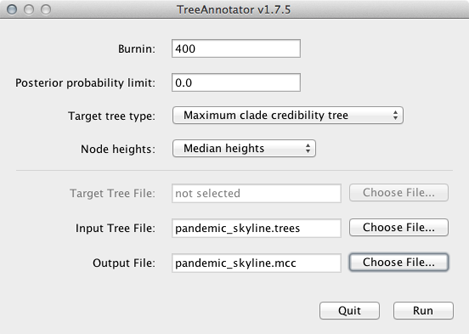

This will print out a single maximum clade credibility (MCC) tree to the file `pandemic_skyline.mcc`.
For convenience, I've included this file as `output/pandemic_skyline.mcc`.

We can now open this MCC tree in FigTree.

**Open FigTree, select 'Open...' from the 'File' menu and choose the file `pandemic_skyline.mcc`.**

This displays the tree with each taxon labeled.
We can get a better idea of the structure of the phylogeny with a bit of tree manipulation.

**Turn off 'Tip Labels' in the left-hand list.**

**Under 'Trees', turn on 'Order nodes' and choose 'decreasing'.**


A pattern of population expansion is visible in the phylogeny as rapid coalescence in early 2009 and slower coalescence later in 2009.
Standing genetic diversity increases through time.

## Prepare a logistic growth analysis

We saw that the skyline analysis suggested that virus population size started off very small near the beginning of 2009 and increased throughout the year, though slowing its rate of increase closer to Sep 2009.
A parametric model of [logistic growth](http://en.wikipedia.org/wiki/Logistic_function#In_ecology:_modeling_population_growth) fits this pattern nicely.
In this model, exponential growth occurs with rate *r*, but is damped as the population size *N* approaches carrying-capacity *K*.
The instantaneous rate of change in population size is:


If we start with some initial population size *N*<sub>0</sub> then we can solve for *N* at an arbitrary time *t*:


However, because TMRCA is constantly varying over the course of the MCMC, BEAST parameterizes logistic growth not in terms of *N*<sub>0</sub>, but instead in terms of *t*<sub>50</sub>, that is the time back from the "present" (in this case 2009.75) when the population is at half its carrying capacity:


Thus, to model logistic growth, we need to estimate *r*, *K* and *t*<sub>50</sub>.

To prepare this XML, start as before, by importing sequence data in the 'Partitions' panel and adding tip dates in the 'Tips' panel.

**Select the 'Trees' panel and choose 'Logistic Growth' from the 'Tree Prior' dropdown.**

This will setup a demographic function based on the above outlined logistic growth model.

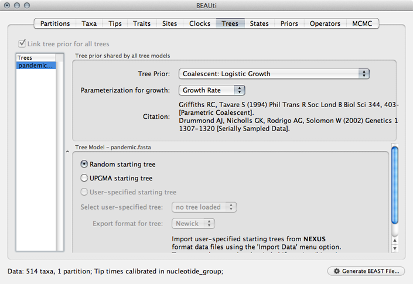

**Select the 'Priors' panel and choose a Uniform(0,1) prior for 'clock.rate'.**

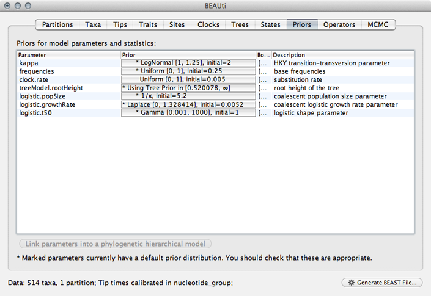

The use of a Gamma prior for 'logistic.t50' is rather strange and I believe exists as a holdover from a previous parameterization using a shape parameter to define timescale rather than 'logistic.t50'.
We'll fix this by editing the raw XML later.

**Select the 'MCMC' panel, set the length of the chain to `50000000`, set logging of parameters every `25000` steps and set the file name stem to `pandemic_logistic`.**

This will log parameters and trees to `pandemic_logistic.log` and `pandemic_logistic.trees`.

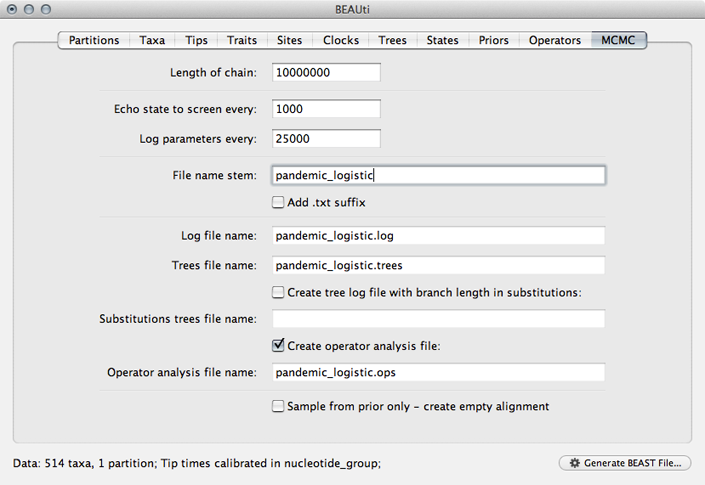

**Save the XML file as `pandemic_logistic.xml`.**

**Open the resulting file in a text editor and delete the 'trait' block from the the 'logTree' block as before.**

We will also manually set the prior on 'logistic.t50' by replacing the 'gammaPrior' with:

```xml
<uniformPrior lower="0.0" upper="1.0">
	<parameter idref="logistic.t50"/>
</uniformPrior>	
```

With this completed, we are ready to run this analysis in BEAST.

## Run the logistic growth analysis

**Open BEAST, select the file `pandemic_logistic.xml` and choose 'Run'.**

This will produce the output files `pandemic_logistic.log` and `pandemic_logistic.trees`, again taking ~16 hours to complete on a single cluster node.

I've included these files with the practical as `output/pandemic_logistic.log` and `output/pandemic_logistic.trees`.

## Examine the logistic growth output

**Open `pandemic_logistic.log` in Tracer.**

Here, we see that each trace is behaving well, but that we need to set the burn-in higher than the default 5 million.

**Set 'Burn-in' to `10000000` (10 million).**

We get the following parameter estimates and 95% credible intervals for the logistic growth model:

                         | Lower | Mean  | Upper
---                      | ---   | ---   | ----
*K* (individual years)   | 9.49  | 48.38 | 140.49
*r* (per year)           | 6.65  | 10.64 | 14.47
*t*<sub>50</sub> (years) | 0.02  | 0.17  | 0.28

Tracer can also be used to reconstruct population size through time according to the logistic growth model.

**Choose 'Demographic Reconstruction...' from the 'Analysis' menu.**

In the resulting dialog box, the demographic function chosen needs to be matched to the one actually used.

**Select 'Logistic Growth (Growth Rate)' from the 'Demographic Model' dropdown.**

The traces used for each of the three parameters are selected automatically.
However, overall timescale still needs to be set.

**Enter `2009.75` for 'Age of youngest tip'.**

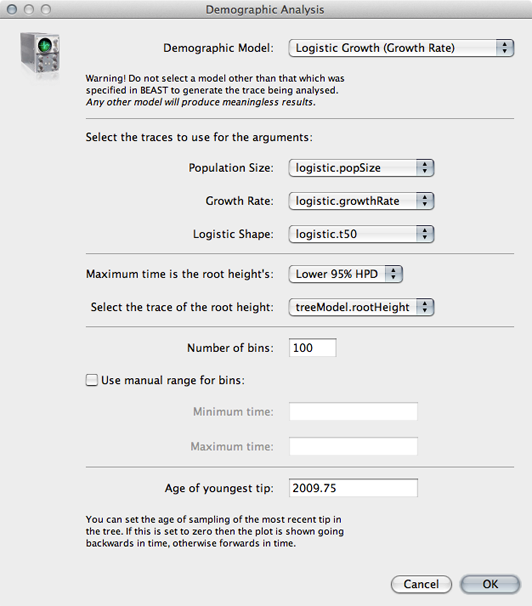

**Click on 'OK' to perform the analysis.**

The resulting window shows the median estimate of population size through time, as well as its 95% credible interval.


Here, we see that population size has grown exponentially until around July or August when it's begun to saturate.
However, although the rate of initial exponential increase appears fairly well defined, there appears to be little certainty to the degree of recent saturation.

The equation log(2) / *r* can be used to calculate the doubling time in years of virus population.
The doubling time in days can be calculated by multiplying this by 365.

                     | Lower | Mean  | Upper
---                  | ---   | ---   | ----
Doubling time (days) | 17.48 | 23.78 | 38.04

Additionally, with knowledge of the serial interval between infections we can convert the growth rate in terms of years into an estimate of the fundamental reproductive number *R*<sub>0</sub>.
If we convert growth rate *r* into days, we get a mean estimate of 0.029 per day.
From basic [SIR dynamics](http://en.wikipedia.org/wiki/Compartmental_models_in_epidemiology) we expect the per-day rate of increase to be equal to the per-day contact rate *&beta;* minus the per-day recovery rate *&gamma;*.
Thus, we can solve for *&beta;* = *r* + *&gamma;*.
In this case, we can assume a 3 day duration of infection and thus *&gamma;* = 0.333 per day.
We estimate *&beta;* = 0.029 + 0.333 = 0.362 per day.
Then, by definition, *R*<sub>0</sub> = *&beta;* / *&gamma;* = 0.362 / 0.333 = 1.09.

These estimates of viral population size are not in units of individuals, but instead in the same units as the phylogeny and thus years.
Population size in BEAST is the inverse of the rate of coalescence and is equal to effective population size *N*<sub>e</sub> multiplied by the generation time *&tau;* in years.
Early in the epidemic, when the fraction susceptible is close to 1, we expect generation time to depend only on contact rate, so that *&tau;* = 1 / (2 *&beta;*).
In this case, we estimate generation time early in the epidemic as *&tau;* = 1 / (2 * 0.362) = 1.38 days or 0.0038 years.
Thus, we can divide estimates of population size from BEAST by 0.0038 years to get an estimate of the number of individuals.
At the beginning of July, the logistic model estimates *N*<sub>e</sub> *&tau;* = 14.47 and thus predicts *N*<sub>e</sub> = 3809 infected individuals.
At the same time, the skyline model estimates a similar number of individuals.

Differences between census population size *N* and effective population size *N*<sub>e</sub> can be quite large, and can be generally explained by a large variance in the reproductive success of individual infections.
If the progeny of some infections are much more successful than the progeny of other infections in terms of eventual genetic legacy, there will be a large difference between *N* and *N*<sub>e</sub>.
This variance could arise from a variety of sources, including super-spreading, spatial effects and natural selection.

## Prepare a phylogeographic analysis

Here, let's keep the same model of logistic growth as before.

**Open BEAUti and rebuild the logistic growth analysis.**

We next need to load the geographic metadata into BEAUti.

**Select the 'Traits' panel and click on the 'Add trait' button.**

**In the resulting dialog 'Create a new trait' named location.**

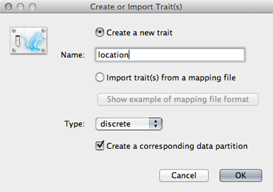

Similar to tip dates, we will import trait values from taxon names.

**Click on 'Guess trait values' and choose 'second from last' in the 'Defined by its order' dropdown.**

**Enter `_` as the delimiter.**


Doing so results in a discrete trait being associated with each taxon.


We next need to give a model for how each location character state transitions to other location characeter states.

**Select the 'Sites' panel and click on 'location' in the left-hand list of data partitions.**

We will use a 'Symmetric substitution model' where the rate that A goes to B equals the rate that B goes to A.
Although the asymmetric model seems like it should better match reality, using it adds significant parameter complexity and additionally sacrifices a fair degree of robustness to sampling particulars.

**Select 'Infer social network with BSSVS'.**

I have no idea why this is called "infer social network".
BSSVS stands for Bayesian Stochastic Search Variable Selection.
It adds an indicator variable for each pairwise transition rate that specifies whether the rate is on or off, i.e. at its estimated value or at 0.
These indicators serve to decrease the effective number of rate parameters that need to be estimated and are helpful to include when trying to infer a sparse transition matrix.

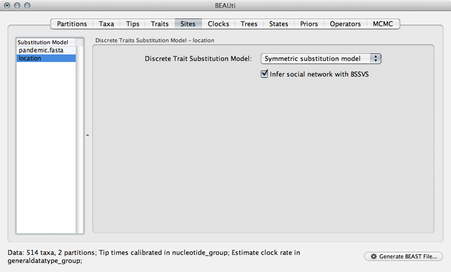

As with the sequence partition, we also need to include a model of how geographic transition rate relates to time.

**Select the 'Clocks' panel.**

We will stick with the default 'Strict clock' for transitions among geographic locations.

**Select the 'Trees' panel.**

We don't need to do anything here, because the sequences and the geographic locations are based on the same underlying evolutionary tree.

**Select the 'States' panel and click on 'location' in the left-hand list of data partitions.**

In addition to reconstructing states at all ancestors, we are particularly interested in where in the world the pandemic emerged.

**Select 'Reconstruct states' at 'Tree Root'.**

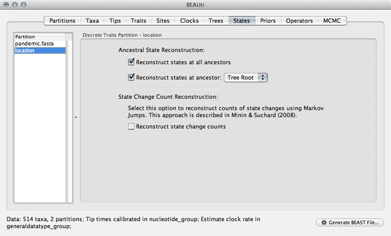

We need to include priors on parameters associated with the phylogeographic model.

**Select the 'Priors' panel.**

We need to give a prior to the overall geographic transition rate.

**Select the 'location.clock.rate' prior and choose 'Exponential' from the dropdown.**

We will leave mean and initial value set to 1.0.


We will leave the proposals at their defaults.

**Select the 'MCMC' panel, set the length of the chain to `50000000`, set logging of parameters every `25000` steps and set the file name stem to `pandemic_geo`.**

**Save the analysis as `pandemic_geo.xml`.**

It will be helpful to edit the XML to give more interpretable logging.

**Open `pandemic_geo.xml` in a text editor and delete the strictClockBranchRates traits blocks from the the 'logTree' block as before.**

**Replace the gammaPrior with a uniform prior for 'logistic.t50' as before.**

```xml
<uniformPrior lower="0.0" upper="1.0">
	<parameter idref="logistic.t50"/>
</uniformPrior>	
```

Replace the file name `pandemic_geo.location.rates.log` with `pandemic_geo.rates`.
Replace the output in 'pandemic_geo.locationrateMatrixLog' with more interpretable estimates of indicators multiplied by rate values.
These are stored in 'location.actualRates'.

```xml
<log id="pandemic_geo.locationrateMatrixLog" logEvery="25000" fileName="pandemic_geo.rates">
	<statistic idref="location.actualRates"/>
</log>
```

Also, replace the file name `location.states.log` with `pandemic_geo.root`.

I've included this file with the practical as `pandemic_geo.xml`

## Run the phylogeographic analysis

**Open BEAST and select the file `pandemic_geo.xml`.**

This analysis (because of the function to infer ancestral states) requires that BEAGLE be loaded.

**Select 'Use BEAGLE library if available'.**

Generally, I turn on SSE as this should give a decent speed increase and set the 'Rescaling scheme' to 'Dynamic'.

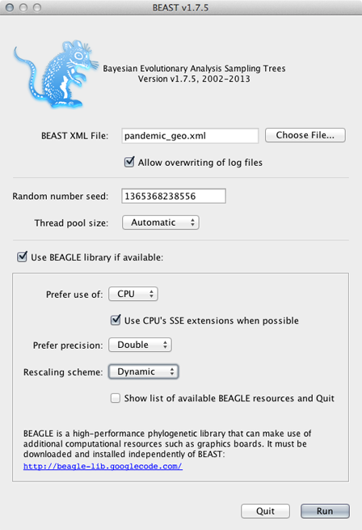

**Click on 'Run'.**

This will produce the output files `pandemic_geo.log`, `pandemic_geo.rates`, `pandemic_geo.root` and `pandemic_geo.trees`.
This analysis took ~24 hours to complete on a single cluster node.

I've included these files with the practical in the `output/` directory.

## Examine the phylogeographic output

**Open `pandemic_geo.log` in Tracer and increase 'Burn-in' to `10000000` (10 million).**

Here, we first confirm that the MCMC chain has converged and appears to be behaving properly.
The overall rate that one geographic location transitions to another location is measured by 'location.clock.rate'.

                                      | Lower | Mean | Upper
---                                   | ---   | ---  | ----
Geographic transition rate (per year) | 3.86  | 5.45  | 6.91

Let's now take a look at the geo-encoded phylogeny.
As before, we need to prepare a single MCC tree from the trees file.

**Open TreeAnnotator, set 'Burnin' to `400`, set 'Input file' to `pandemic_geo.trees` and 'Output file' to `pandemic_geo.mcc`.**

This will result in the file `pandemic_geo.mcc`, which I've included in the `output/` directory for convenience.

**Open FigTree and load the `pandemic_geo.mcc` file.**

As before, we will begin by streamlining the tree a bit.

**Turn off 'Tip labels' and 'Order nodes' in 'decreasing' order.**

We will annotate nodes with their geographic locations based on color.

**Turn on 'Node Shapes', enter `8` as 'Max size' and 'Colour by' location.**

This results in nodes colored by their most likely location.

**Click on 'Setup: Colour' to get a list of location colors.**

Elements of this list can be dragged up and down to get a more logical grouping of colors and locations.

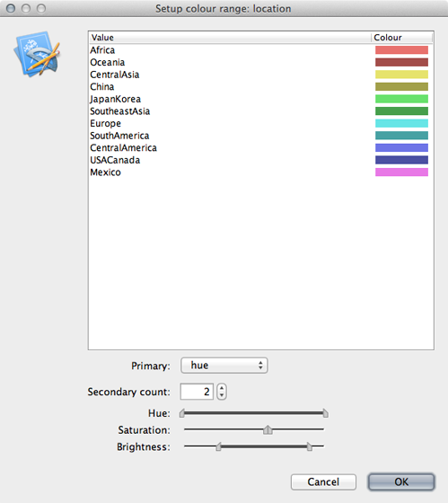

Including a legend will make this more clear.

**Turn on 'Legend' and choose 'location' for 'Attribute'.**

The resulting phylogenies shows early nodes in Mexico and the USA and from them spreading to the rest of the world.

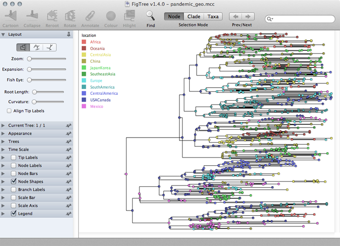

Adjustments can be made in the 'Layout' list to better see transitions between locations.

In the phylogeographic reconstruction, each node in each MCMC sample is annotated with a geographic location.
The certainty of the geographic reconstruction can be assessed by looking the distribution of node states across the MCMC.
The file `pandemic_geo.root` gives the reconstruction of the root node across the MCMC.
Here, we see the following distribution:

               | Frequency
---            | ---
Africa         | 0%
CentralAmerica | 5%
CentralAsia    | 0%
China          | 3%
Europe         | 3%
JapanKorea     | 1%
Mexico         | 63%
USACanada      | 22%
Oceania        | 0%
SouthAmerica   | 2%
SoutheastAsia  | 1%

Thus, we're quite confident in a Mexican origin of pandemic, though the USA receives a small amount of weight as well.

In addition, the phylogeographic reconstruction can be visualized as a spread across the globe, in a map-centric fashion, rather than the previous tree-centric visualization.
To do this, we will run a small script on the MCC tree that will create a KML file that can be viewed in Google Earth.
This script is called `phylogeo.jar` as is located in the `scripts/` directory.
This analysis requires latitude and longitude coordinates for each location in a tab-delimited file.
I've included this as `data/locs.txt`.

To run the script, open a terminal window, navigate to the `output/` directory and run the following:

```
java -jar ../scripts/phylogeo.jar -coordinates ../data/locs.txt -annotation location -mrsd 2009.75 pandemic_geo.mcc pandemic_geo.kml
```

This specifies the `locs.txt` coordinates file, that the geographic character state is called `location`, that the most recent tip is at `2009.75` and that the MCC tree is the file `pandemic_geo.mcc`.
Running this script generates the file `pandemic_geo.kml`, which I've included in the `output/` directory.

**Open Google Earth and open the `pandemic_geo.kml` file.**

This will display well-supported transitions on the globe and includes their date of occurence.

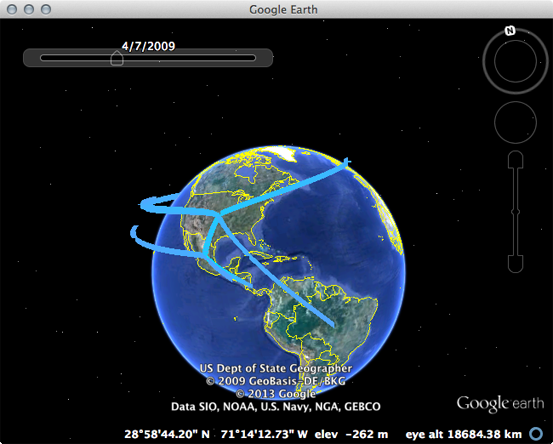

The emergence in Mexico and spread from the USA to the rest of the world can be clearly seen.
